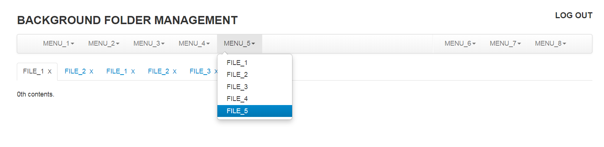

# Introduction
if you are looking for a text-heavy simple website management template. why are you not use folder management template?  This template uses the style of folder management, which can support two-level directory. This template can deal with the most needs in a text-heavy scenario.

# Environment
Technology: Html5 + JQuery2.0.0

Languange: Chinese

# Directory Structures
below is a simplification directory structure.
 
```
E:.
|   login.html
|   main.html
|
+---css
|       admin.css
|
+---img
|       logo.png
|       titleIcon.ico
|
\---js
        admin.js
        jquery-2.0.0.min.js
```

# Feature
There are three main parts that whose are navigation_bar and n avigation_tab and tab_content.

The navigation bars contain serials of menus that which contain serials of file items.

The navigation tabs contain serials of tabs that which is the display name of a content tab.

The tab content contains serials of file content that which can be text document or data form or other format, it depends on which you are expecting.

# How to add an item in Navigation Bars
Add an item in navigation Bars is simple. just need to throw up the below little snippet into  `<ul class="nav"></ul>` node.
```THML
<li class="dropdown">
	<a data-toggle="dropdown" class="dropdown-toggle" href="#">MENU_1<strong class="caret"></strong></a>
	<ul class="dropdown-menu">
		<li><a href="#">FILE_1</a></li>
		<li><a href="#">FILE_2</a></li>
	</ul>
</li>
```
# How to add an item in Navigation Tabs
if you have added an item in Navigation Bars, then you may need to add an item in Navigation Tabs also. add a `<li></li>` node in the  `<ul class="nav nav-tabs"></ul>` element. for example:
```HTML
<li class="active"  menutext="MUNE_!" title="MUNE_1/FILE_1"><a href="#panel-927039"	data-toggle="tab">文件1<span class="nav-close" onclick="panelClose(this)">X</span></a></li>
```
the `class="active"` represent the current Tab is active.
the `menutext` should be the corresponding menu.
the `title` should be the format `mune/file`

# How to add a tab content
The tab content is the main part, which handles text display.
```HTML
<div class="tab-pane active" id="panel-927039">
	<p>zero contents.</p>
</div>
```
the `tab-pane` represent this *div* is a tab pane. and `active` represent this tab is active. and the `id` should be corresponding the `href` attribute of item in navigation tab. the item was the one which was added before.


# How to handle the click event in an option in menu options. 
Handle the click event, user should do two things at least.

**first:**
register an callback function. at `register` function in `Register` class in *js/admin.js*, invoke `Register.add(menu,file.func)` to register a function on specific `menu` and `file`.

```JAVASCRIPT
static register(){
  Register.add("MENU_1","FILE_1",func1);
  Register.add("MENU_1","FILE_2",func2);
}
```

**second:**
write the corresponding function.

```JAVASCRIPT
function func1(eve){//corresponding with MENU_1 and FILE_1
	console.log("in MENU_1/FILE_1");
}
function func2(eve){//corresponding with MENU_1 and FILE_2
	console.log("in MUNU_1/FILE_2");
}
```

# Screenshot

